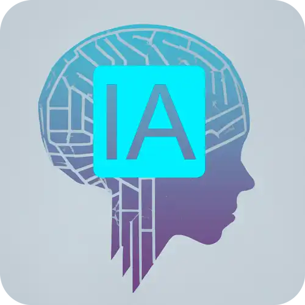

    <h1>Python AI Backend Developer</h1>

  

    
                   

  

  

     
  

              
    
                         

  

    
    

 

<h3>67 horas | 32 cursos | 7 desafios de projeto | 2 desafios de código | 1 lives</h3>

## Introdução
Olá,

Esse repositório corresponde ao projeto "
Modelando o Sistema Bancário em POO com Python" da [DIO - Digital Innovation One](https://www.dio.me/).

## Objetivo

Neste desafio foi atualizado a implementação do sistema bancário, para armazenar os dados de clientes e contas bancárias em objetos ao invés de dicionários. O código deve seguir o modelo de classes UML.

Explorado todos os conceitos que aprendemos nessa imersão e replicado este projeto prático. 
 

## Próximos passos

Continuar o evoluindo no estudo com Python e o paradigma POO para futuros projetos e aplicações. 

## Tecnologias Utilizadas

## Cursos Envolvidos
### **Python AI Backend Developer** 
#### **Orientação a Objetos e Boas Práticas em Python:**
- Modelando o Sistema Bancário em POO com Python.

## Repositório Original do GitHub
Referência direta ao código-fonte original.

- Guilherme Carvalho: [Guilherme Carvalho](https://github.com/guicarvalho)
- Endereço DIO: [trilha-python-dio](https://github.com/digitalinnovationone/trilha-python-dio/tree/main/02%20-%20Programa%C3%A7%C3%A3o%20Orientada%20a%20Objetos/10%20-%20desafio)

## Agradecimentos
Gostaria de agradecer a [DIO - Digital Innovation One](https://www.dio.me/) e ao instrutor [Guilherme Carvalho](https://github.com/guicarvalho) por compartilhar seu conhecimento.
